Natividad Márquez Baena

# Configuración de un Servidor Nginx con Hosts Virtuales y Directorios de Usuario

1. Introducción
2. Instalación de nginx
3. Creación de Usuarios del Sistema
4. Configuración de Directorios y Permisos
5. Creación de Contenido Web
6. Configuración de Nginx para Hosts Virtuales
7. Generación de Certificados SSL
8. Configuración del Archivo Hosts
9. Comprobación de Funcionamiento de los Hosts Virtuales

## Introducción
En esta práctica, se configurará un servidor web Nginx, capaz de manejar múltiples sitios mediante hosts virtuales. Además se le atribuirán a usuarios del sistema permisos para que gestionen sus propios sitios a través de directorios ``public_html``, todo esto en un entorno accesible y seguro mediante la implementación de conexiones HTTPS.

## Instalación de nginx

Para esta práctica, se trabajará desde una máquina anfitriona que estará conectada a una máquina virtual que ejecuta el sistema operativo Debian. Esta conexión se realizará a través del protocolo SSH (Secure Shell), que proporciona un acceso remoto seguro al servidor mediante una conexión cifrada y con credenciales de acceso. Se ha utilizado el nombre de usuario y la ip de la máquina virtual.

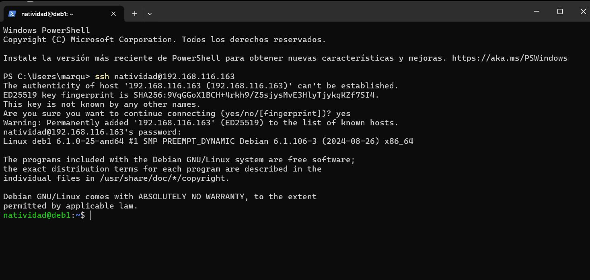

## Creación de Usuarios del Sistema

Se crearán dos usuarios para esta práctica, se usará el comando ``sudo useradd -m -s /bin/bash nombre_usuario``, donde -m creará un directorio personal para el usuario y -s especifica que el shell asignado al usuario será Bash.

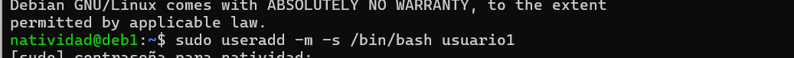

Una vez creado el usuario, es necesario asignar una contraseña y acceder para comprobar que se ha creado correctamente:

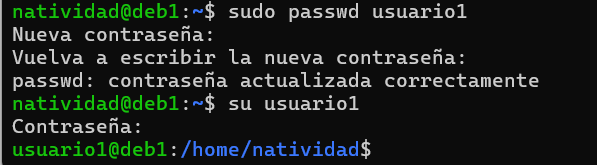
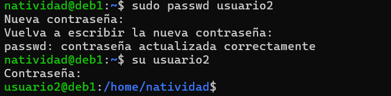

## Configuración de Directorios y Permisos

Se crean directorios para public_html dentro de los usuarios creados.

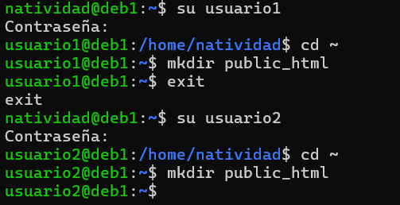

Ahora se asignarán permisos. Para garantizar que el servidor web Nginx pueda acceder al contenido de los directorios public_html de cada usuario, es necesario ajustar los permisos de dichas carpetas. Se configurarán las Listas de Control de Acceso (ACL) utilizando el comando setfacl.

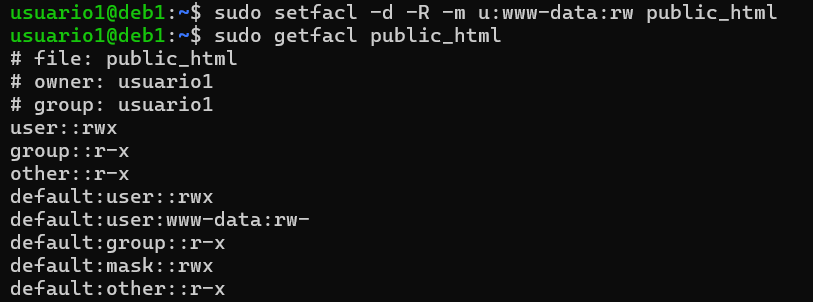
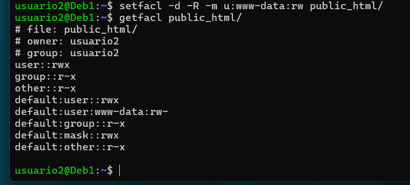

## Creación de Contenido Web

Se crearán dos archivos ``index.html`` para los usuarios creados en las carpetas public_html. Primero para el usuario 1:

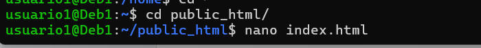
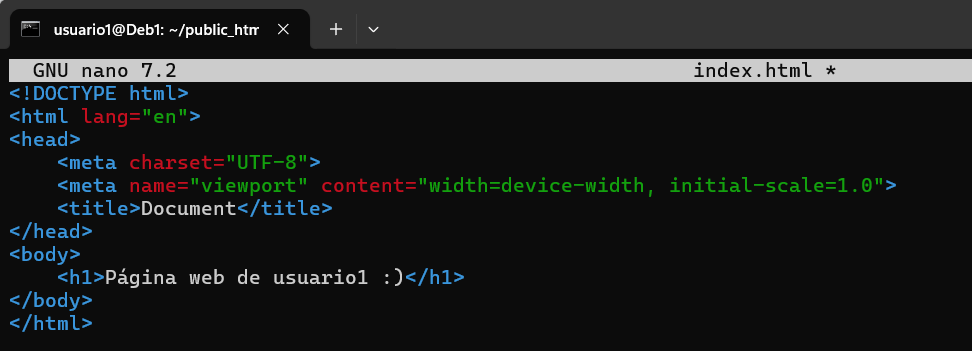

Y también al usuario 2:

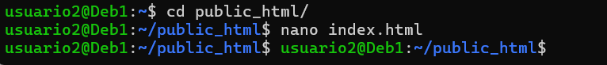
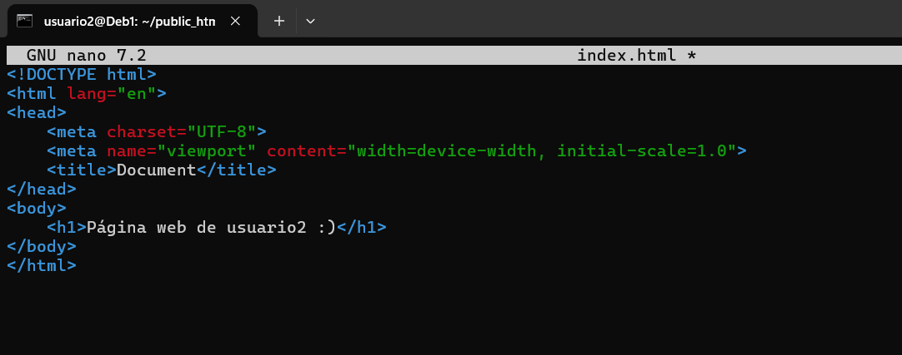

## Configuración de Nginx para Hosts Virtuales

El servidor Nginx es una pieza clave en esta práctica, ya que será el encargado de servir los sitios web alojados en los directorios ``public_html`` de cada usuario. En este equipo nginx estaba instalado previamente, consultamos su estado con ``systemctl status nginx``.
En caso de no disponerlo, se puede instalar mediante ``apt-get install nginx``.

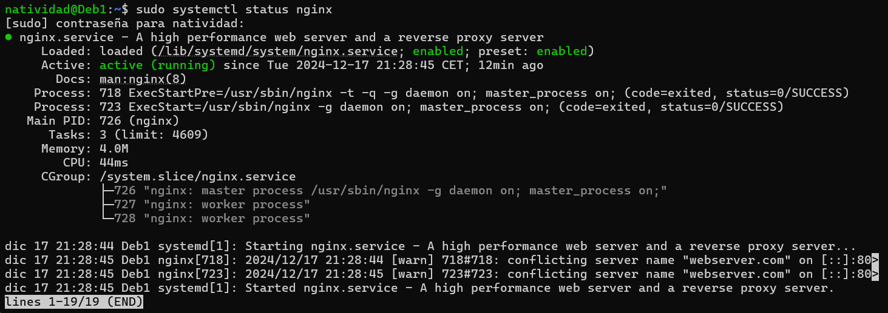

## Generación de Certificados SSL

El uso de certificados SSL es fundamental para garantizar la seguridad de las conexiones entre los usuarios y el servidor web. Se generarán certificados autofirmados para habilitar la conexión segura mediante HTTPS para cada uno de los usuarios. La emisión de certificados se realizará para ambos usuarios.

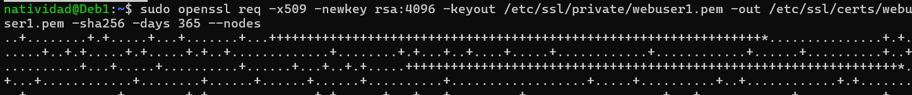
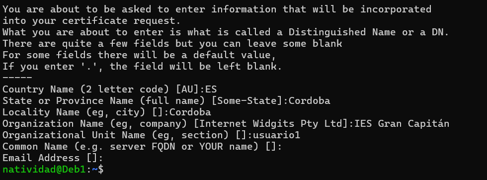

Se solicitará una serie de datos durante la generación del certificado. Algunos de ellos aparecerán en el certificado cuando se muestre. 

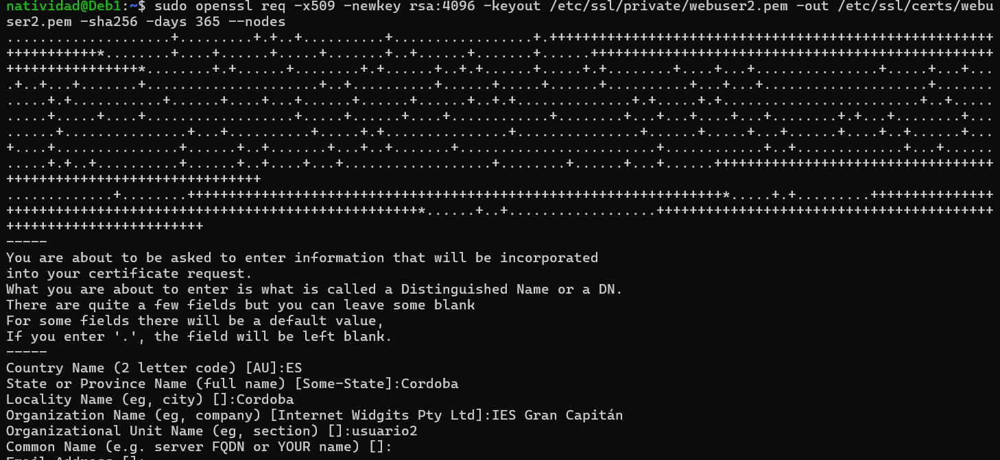

## Configuración del Archivo Hosts

Crearemos un archivo de configuración para el usuario1 y usuario2 dentro del directorio ``/etc/nginx/sites-available``.

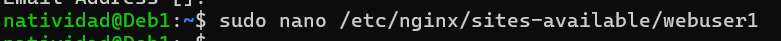

Dentro del archivo, agrega la siguiente configuración:

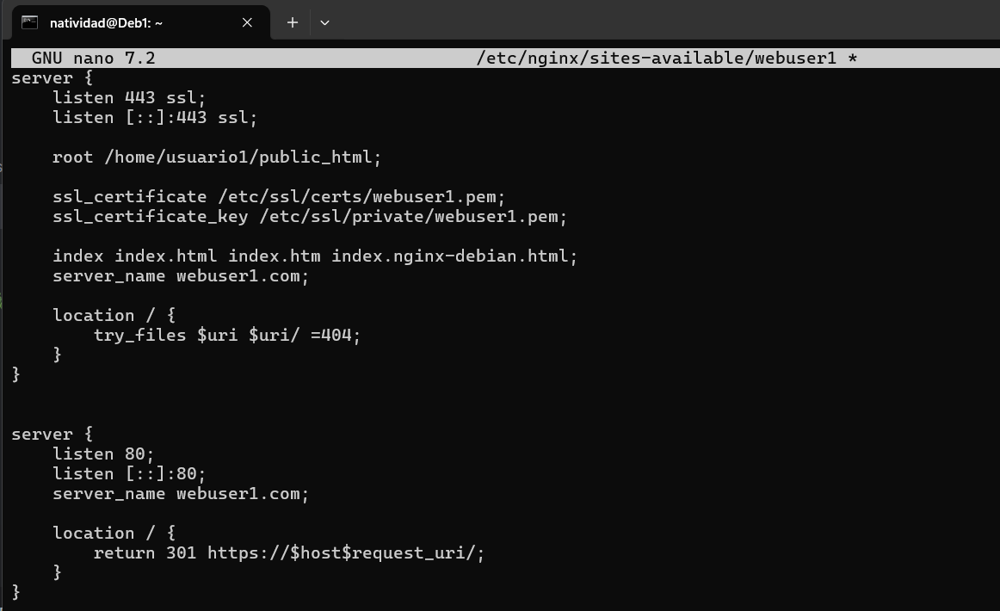
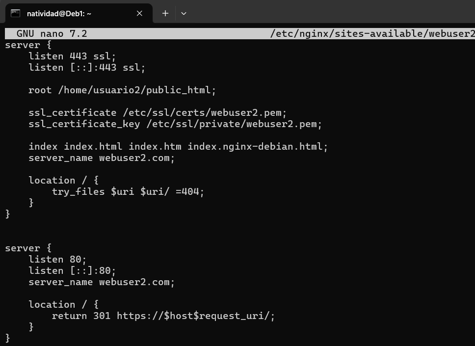

Se crearán enlaces simbólicos de los archivos de los dos usuarios  (``sites-available``), deben habilitarse creando enlaces simbólicos en ``sites-enabled``.

Se hará uso del comando ``nginx -t`` para comprobar que la sintaxis es correcta y reiniciar el sistema.

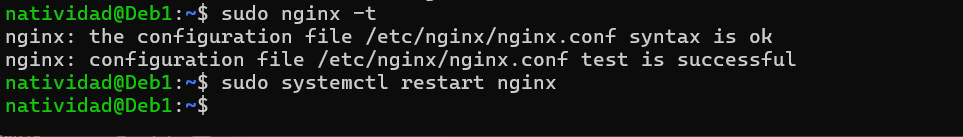

Es importante modificar el archivo hosts del sistema que se encuentra en ``C:\Windows\System32\drivers\etc\hosts``. Se añade al archivo la dirección IP y los nombres de los host virtuales.

## Comprobación de Funcionamiento de los Hosts Virtuales

Por último se comprueba el acceso a los sitios web de los usuarios desde el navegador web y los certificados emitivos.
Para acceder al sitio con https, se abre un navegador web en la máquina anfitriona, se ingresa la URL y se nos indicará si la conexión es segura. En este paso se puede comprobar los detalles del certificado como su validez, el dominio y por quién ha sido emitido como autofirmado. 

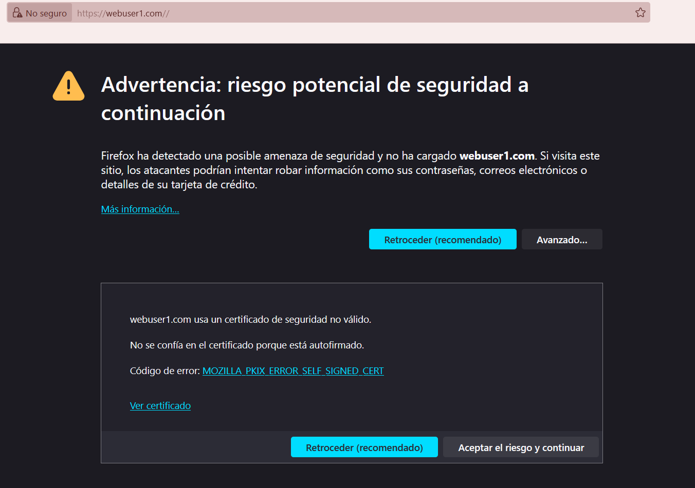

Se debería de visualizar el contenido de la web.

Lo mismo para el otro sitio web.

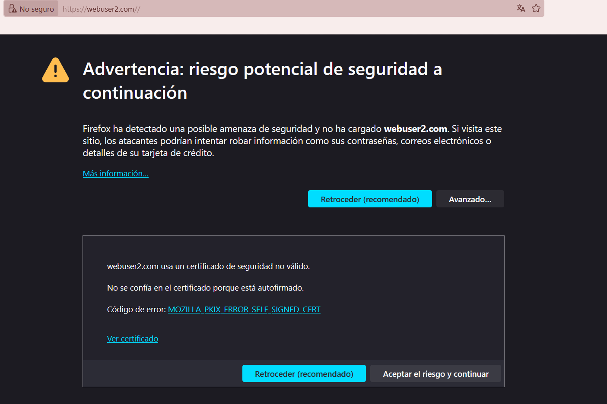
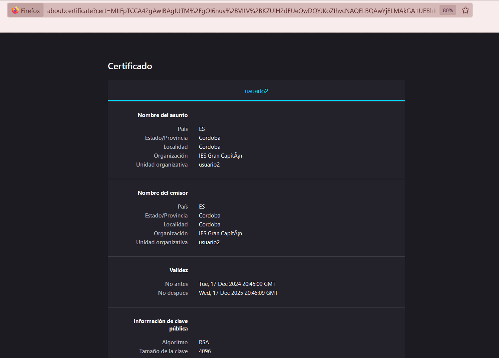

Para finalmente visualizar el contenido. 

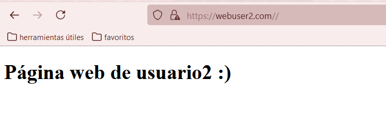

